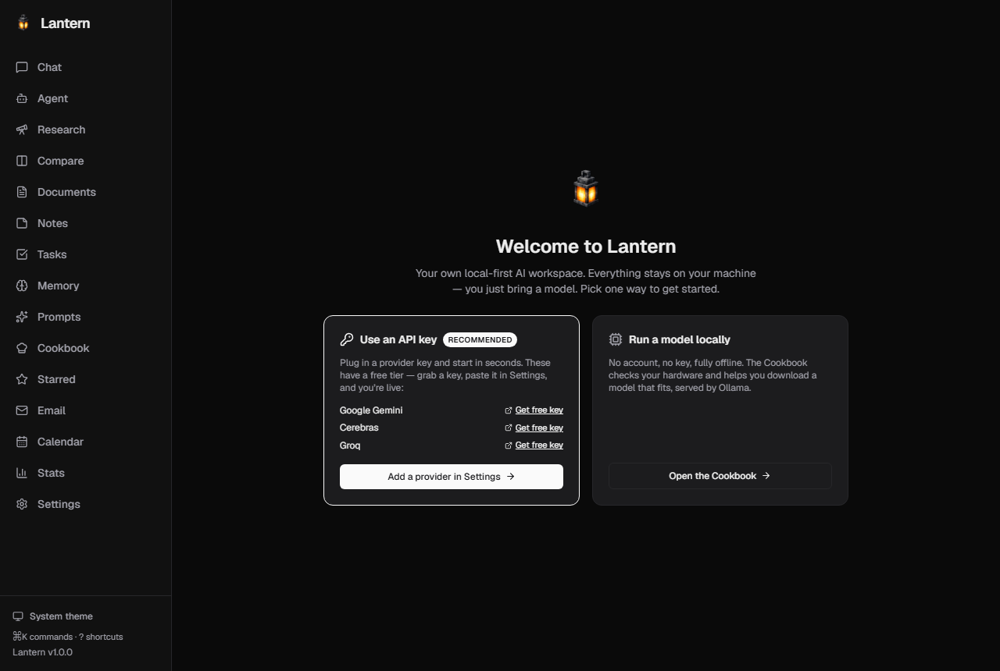
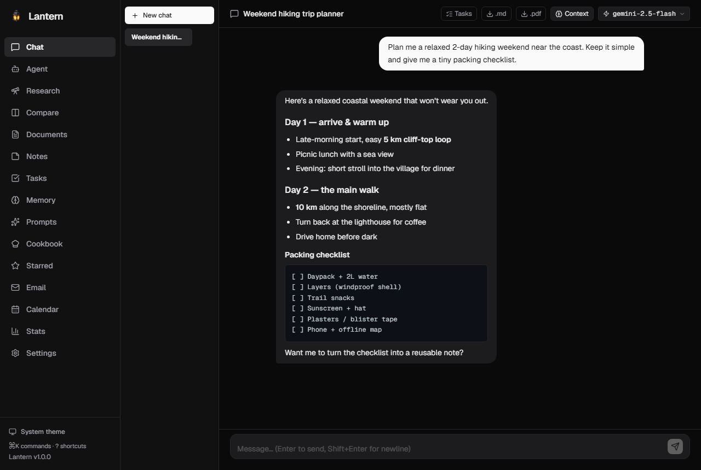
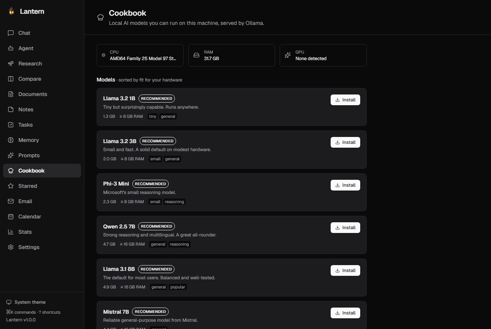
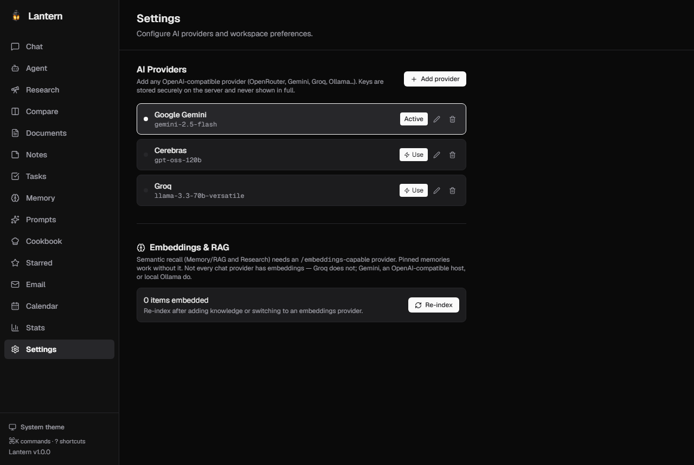

# 🏮 Lantern

> A self-hosted AI workspace — **local-first, privacy-first.** Carry your own light.

Lantern is your own ChatGPT/Claude-style workspace, running on **your** hardware
with **your** data. The download is small and quick — bring your own provider
API key (each has a free tier) and you're chatting in seconds. Want fully local,
offline models instead? Install [Ollama](https://ollama.com/download) and
Lantern's hardware-aware **Cookbook** downloads a model that fits, in one click.
Nothing leaves your machine unless you explicitly route a chat through a cloud
provider.

> **Status:** v1 desktop app — Chat, Agent, Compare, Research, Documents, Notes,
> Tasks, Memory, Prompts, Stars, Email, Calendar, Stats, and a hardware-aware
> Cookbook for installing local models in one click. Installs and launches on
> macOS/Windows/Linux. **81 backend tests passing**, web build clean.

## Screenshots

|  |  |
|---|---|
| **Plug-and-play onboarding** — bring an API key or run a model locally | **Chat** — streaming, Markdown + code, export, model switcher |
|  |  |
| **Cookbook** — hardware-aware local model picker | **Settings** — mix local + cloud providers |
|  |  |

## ⬇️ Download & install (just want to use it?)

Grab the installer for your OS from the
[**Releases**](https://github.com/larsenddk-dev/lantern/releases) page:

| OS | File | Notes |
|---|---|---|
| **macOS (Apple Silicon)** | `Lantern_*_aarch64.dmg` | Lightweight — the app + local API, no giant AI bundle |
| **Windows** | `Lantern_*_x64-setup.exe` | `.exe` (NSIS) or `.msi` |
| **Linux x86_64** | `Lantern_*_amd64.AppImage` | also `.deb` |

> Local models are **not** bundled (that would balloon the download to
> gigabytes). Cloud providers work immediately with your API key; for offline
> local models, install [Ollama](https://ollama.com/download) once and Lantern
> picks it up automatically.

> Lantern is free, open, and **unsigned**, so the OS will warn the first time
> you run it:
> - **Windows:** SmartScreen says *"Windows protected your PC"* → click
>   **More info → Run anyway**.
> - **macOS:** right-click the app → **Open** → confirm. The first launch can
>   take 30-60 seconds while macOS Gatekeeper scans the bundle; after that it's
>   sub-2-second startup.
> - **Linux:** `chmod +x Lantern_*_amd64.AppImage && ./Lantern_*_amd64.AppImage`

### Your first 60 seconds

1. **Launch Lantern.** On first run you land on a **Welcome** screen with two
   ways to get started — pick whichever you prefer.
2. **Fastest — bring an API key:** open **Settings → Add provider**, pick a
   preset with a free tier (Gemini, Cerebras, Groq…), grab a key from the linked
   page, paste it, and you're live in seconds. Nothing to download.
3. **Or run a model locally (offline, no key):** install
   [Ollama](https://ollama.com/download) once, then open the **Cookbook** — a
   list of local AI models sized and ranked for your hardware (RAM, GPU detected
   automatically). Click **"Install"** on a recommended model — for most people
   on 8-16 GB RAM that's **Llama 3.2 3B** (2 GB) or **Llama 3.1 8B** (4.9 GB) —
   then **"Use in chat"**. The model runs entirely on your hardware.

Either way you're then in a fully featured workspace — explore the sidebar.

### Mixing local and cloud

You can configure both and switch per chat from the model picker in the header.
Add more cloud providers any time under **Settings → Add provider** (OpenRouter,
Groq, Mistral, Gemini, Cerebras, OpenAI, …).

## Features

Every area below is real, working, and tested. Chat is the workhorse; the
others are productivity tools you'll discover as you use it.

| Area | What it does |
|---|---|
| **Chat** | Streaming · Markdown + syntax highlighting · stop / pause / retry · edit + delete individual messages · star · save-as-memory · export `.md`/`.pdf` · keyboard shortcuts |
| **Cookbook** | Hardware-aware local model picker (Ollama). Detects your RAM/GPU, recommends models that fit, one-click install, one-click activate. |
| **Agent** | Tool-calling loop (knowledge search, list notes/tasks, calculator, optional web search) |
| **Research** | Plan → gather (via RAG + web) → synthesised report · export `.md`/`.pdf` |
| **Compare** | One prompt → multiple models side by side · per-target error capture |
| **Documents** | Drag-drop upload · text extraction (.txt/.md/.pdf/.docx) · filter |
| **Notes** | CRUD · save-as-memory · Markdown export · filter |
| **Tasks** | CRUD · toggle done · **AI-generate tasks** from a chat conversation |
| **Memory + RAG** | Remembered facts (pinned or auto-retrieved) injected into chat |
| **Prompts** | Reusable system / user prompts · copy · filter |
| **Starred** | Bookmark individual messages across all chats |
| **Email** | Read-only IMAP inbox + AI-triage (env-keyed — bring your own credentials) |
| **Calendar** | Read-only CalDAV upcoming events (env-keyed) |
| **Stats** | Counts across everything you've created |
| **Global ⌘K** | Fuzzy search across chats, notes, tasks, documents, memories |
| **Shortcuts** | ⌘/Ctrl+1-9 to jump between pages, `?` for the full list |
| **Themes** | Light / dark / system (no-flash) |

### Bring-your-own AI providers (all free tiers)

| Provider | Base URL | Free model example |
|---|---|---|
| Local (Ollama) | `http://127.0.0.1:11434/v1` | whatever you install in Cookbook |
| OpenRouter | `https://openrouter.ai/api/v1` | `openai/gpt-4o-mini` (or any `…:free` id) |
| Google Gemini | `https://generativelanguage.googleapis.com/v1beta/openai` | `gemini-2.5-flash` |
| Groq | `https://api.groq.com/openai/v1` | `llama-3.3-70b-versatile` |
| Mistral | `https://api.mistral.ai/v1` | `mistral-small-latest` |
| Cerebras | `https://api.cerebras.ai/v1` | `gpt-oss-120b` |

API keys you enter live **only** in `apps/api/data/lantern.db` (gitignored).
Nothing is sent to any third party that isn't the provider you explicitly
routed a chat to.

## How it works under the hood

```
  ┌──────────────────────────────────────────────────────────┐
  │                   Lantern desktop app                    │
  │                                                          │
  │  ┌─────────────┐    ┌──────────────┐    ┌─────────────┐  │
  │  │  Next.js    │ ↔  │   FastAPI    │ ↔  │   Ollama    │  │
  │  │  (webview)  │    │   (sidecar)  │    │  (sidecar)  │  │
  │  └─────────────┘    └──────────────┘    └─────────────┘  │
  │         UI            sessions, RAG,      local models    │
  │                      provider routing                     │
  └──────────────────────────────────────────────────────────┘
```

The Tauri shell wraps a static export of the Next.js app and spawns the
**lantern-api** sidecar on startup:

- **lantern-api** — a PyInstaller-packaged FastAPI server (port 8000) that
  owns the SQLite database, provider routing, RAG, agents, and research.
- **Ollama** *(optional, not bundled)* — the upstream Ollama runtime
  (port 11434). Install it yourself for offline local models; Lantern detects it
  on `:11434` at start and the Cookbook drives it. It's deliberately left out of
  the installer (it's ~3.5 GB) so the download stays small and the build fast.

## Local development

You don't need this if you just want to use the app — the installer above is
self-contained (Ollama aside). This is for hacking on Lantern itself.

### 1. Configure environment

```bash
cp .env.example .env
# Edit if you want an env-level default provider; otherwise skip and use
# the Settings UI or Cookbook instead.
```

### 2. Start the API

```bash
cd apps/api
python3 -m venv .venv
source .venv/bin/activate   # Windows: .venv\Scripts\activate
pip install -r requirements.txt
uvicorn main:app --reload --port 8000
```

Health check: http://localhost:8000/health

### 3. Start the web app

In a separate terminal:

```bash
cd apps/web
npm install
npm run dev
```

Open http://localhost:3000 — first-run (no provider configured yet) routes you
to `/welcome` to pick a setup path; returning users go to `/chat`.

### 4. (Optional) Install Ollama locally for Cookbook to work

In dev mode Lantern doesn't run a bundled Ollama. Install it once with your
package manager:

```bash
brew install ollama   # macOS
# or:                  https://ollama.com/download
ollama serve &        # in another terminal
```

Cookbook will detect it automatically.

### 5. Run tests

```bash
cd apps/api && pytest -v        # 81 backend tests, all offline
cd apps/web && npm run build    # type-check + static export
```

### 6. (Optional) Build the desktop app locally

```bash
# Build the FastAPI sidecar
cd apps/api
pyinstaller lantern-api.spec
mkdir -p ../desktop/src-tauri/sidecar
rm -rf ../desktop/src-tauri/sidecar/lantern-api
cp -R dist/lantern-api ../desktop/src-tauri/sidecar/lantern-api

# Build the web app
cd ../web && npm run build

# Build the Tauri bundle
cd ../desktop && npm install && npm run tauri build
```

Output ends up under `apps/desktop/src-tauri/target/release/bundle/`.

> Ollama is **not** bundled — the app talks to a user-installed Ollama on
> `:11434`. If you want a self-contained build that ships its own Ollama, run
> `python scripts/fetch-ollama.py` in `apps/desktop` first and re-add
> `"sidecar/ollama/**/*"` to `bundle.resources` in `tauri.conf.json` before the
> Tauri build.

## Tech stack

- **Frontend:** React 19 · Next.js 16 (App Router, static export) · Tailwind CSS · lucide-react
- **Backend:** Python · FastAPI · SQLite · httpx · OpenAI-compatible provider shim
- **Desktop shell:** Tauri 2 · Rust-managed FastAPI sidecar (Ollama optional, user-installed)
- **Local AI engine:** Ollama (not bundled — install separately for offline models)
- **AI providers:** any OpenAI-compatible endpoint — local Ollama, OpenRouter,
  Groq, Mistral, Gemini, Cerebras, OpenAI, Anthropic, …

## Releases

The GitHub Actions workflow at `.github/workflows/desktop-build.yml` builds
installers for macOS, Windows, and Linux. Push a tag matching `v*` and a
draft GitHub Release is created with all three installers attached.

```bash
git tag v1.0.1
git push origin v1.0.1
```

## License

[PolyForm Strict License 1.0.0](./LICENSE) — you may download and run Lantern,
but not modify, redistribute, or sell it. No warranty.

## Workflow

This repo is driven with **[Nogra](https://github.com/nograai/nogra-claude-marketplace)**.
Local Nogra state lives in [`.nogra/`](.nogra/); see [`CLAUDE.md`](CLAUDE.md)
for the workspace contract.
